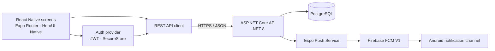

<p align="center">
  
</p>

<p align="center">
  
</p>

<p align="center">
  <strong>Language:</strong>
  <a href="./README.vn.md">🇻🇳 Tiếng Việt</a>
  &nbsp;|&nbsp;
  <a href="./README.md">🇬🇧 English</a>
</p>

<h3 align="center">📱 Boxora Resident Mobile App</h3>

<p align="center">
  A React Native application for residents to manage parcels and interact with the Boxora smart-locker system.
</p>

<p align="center">
  
  
  
  
  
</p>

## Overview

`smart-locking-mobile` is the resident-facing mobile client for Boxora. It uses Expo Router for navigation, a .NET REST API for authenticated operations, SecureStore for local sessions, and Expo Push Notifications with Firebase Cloud Messaging V1 on Android.

Implemented application areas include:

- Resident authentication, token refresh, logout, and profile loading.
- Android push permission, Expo push-token registration, and notification display.
- Parcel dashboard, history, notification, account, delivery approval, overdue-payment, and compartment-unlock screens.
- Responsive UI built with HeroUI Native and Uniwind/Tailwind CSS.

Authentication, resident profiles, and device registration use the backend API. Parcel and delivery workflow screens currently contain prototype/mock data and should be connected to their backend endpoints before production use.

## Quick start

### Requirements

- Node.js 20 or newer and npm.
- JDK 17.
- Android Studio with Android SDK Platform Tools.
- A physical Android device with USB debugging enabled, or an Android emulator.
- For the provided Windows Android script: CMake `3.30.5` and Ninja `1.12.0` or newer.
- Xcode on macOS for iOS development.

### Install

```powershell
git clone https://github.com/se-05-sdlms/smart-locking-mobile
cd smart-locking-mobile
npm install
Copy-Item .env.example .env
```

### Configure the API

The default development configuration expects the backend on port `5005`:

```env
EXPO_PUBLIC_API_URL=http://localhost:5005/api
EXPO_PUBLIC_API_TIMEOUT=15000
```

When a physical Android device is connected by USB, `npm run android` forwards ports `5005` and `8081` through ADB. This allows the device to reach the local backend and Metro through `localhost`.

### Configure Android push notifications

1. Register `com.wykowjbu.boxora` as an Android app in Firebase.
2. Place its public `google-services.json` at the repository root.
3. Upload the Firebase service-account JSON to the Expo project's FCM V1 credentials.
4. Never commit the Firebase service-account JSON or Android signing keys.

The app uses Expo project ID `535b5783-6307-4982-a796-1aa71e988fef` and notification channel `default`.

### Run on Android

Start the .NET backend first, connect and authorize the phone, then run:

```powershell
npm run android
```

The script validates the local Android toolchain, selects the connected device, configures ADB reverse ports, and builds/launches the native development app.

Other development commands:

```powershell
npm start          # Start the Expo development server
npm run ios        # Build and run iOS on macOS
npm run lint       # Run ESLint
npm run typecheck  # Run TypeScript checks
npm run format     # Format supported files
npm run format:check
```

## Tech stack

| Area                | Technology                                             |
| ------------------- | ------------------------------------------------------ |
| Mobile framework    | React Native 0.86, Expo SDK 57                         |
| Language            | TypeScript 6, React 19                                 |
| Navigation          | Expo Router                                            |
| UI and styling      | HeroUI Native, Uniwind, Tailwind CSS 4                 |
| API                 | Fetch-based REST client, JWT access/refresh tokens     |
| Secure storage      | Expo SecureStore                                       |
| Push notifications  | Expo Notifications, Expo Push Service, Firebase FCM V1 |
| Backend             | ASP.NET Core Web API on .NET 8                         |
| Supported platforms | Android and iOS                                        |

## Architecture



The mobile app never connects directly to PostgreSQL or locker hardware. All protected operations go through the backend API.

## Project structure

```text
smart-locking-mobile/
├── assets/                  # App icons and splash assets
├── docs/images/             # README artwork
├── scripts/
│   └── run-android.ps1      # Windows Android build/run helper
├── src/
│   ├── app/                 # Expo Router screens and tab routes
│   ├── components/          # Shared UI and icons
│   ├── config/              # Environment configuration
│   ├── data/                # Prototype parcel data
│   ├── lib/                 # REST API client
│   ├── providers/           # Authentication and push registration
│   └── global.css           # Uniwind/Tailwind and HeroUI styles
├── app.json                 # Expo and native plugin configuration
├── eas.json                 # EAS build profiles
├── google-services.json     # Public Firebase Android client config
├── package.json
├── README.vn.md
└── README.md
```

## Security notes

- `.env` is local-only; commit `.env.example` instead.
- `google-services.json` identifies the Firebase client but does not contain the FCM service-account private key.
- Never commit files matching `*-firebase-adminsdk-*.json`, keystores, signing keys, or production secrets.

## Related repositories

| Component             | Link                                                                                                 |
| --------------------- | ---------------------------------------------------------------------------------------------------- |
| GitHub organization   | [se-05-sdlms](https://github.com/se-05-sdlms)                                                        |
| Web frontend          | [smart-locking-fe](https://github.com/se-05-sdlms/smart-locking-fe)                                  |
| Backend               | [smart-locking-be](https://github.com/se-05-sdlms/smart-locking-be)                                  |
| Project documentation | [Google Drive](https://drive.google.com/drive/folders/1M3OPsm2NxAi7WnAfsKgV4MQEMRy5rOsa?usp=sharing) |

## Development team

- **Project code:** `SDLMS`
- **Group:** `SE_05`

### Supervisor

| Full name            | Role       | Email                                       |
| -------------------- | ---------- | ------------------------------------------- |
| MSc. Lê Thị Bích Tra | Supervisor | [traltb@fe.edu.vn](mailto:traltb@fe.edu.vn) |

### Members

| Student ID | Full name            | Role        | Email                                                             |
| ---------- | -------------------- | ----------- | ----------------------------------------------------------------- |
| DE180519   | Nguyễn Phan Huy      | Team Leader | [huynpde180519@fpt.edu.vn](mailto:huynpde180519@fpt.edu.vn)       |
| DE180405   | Phan Thành Vương     | Member      | [vuongptde180405@fpt.edu.vn](mailto:vuongptde180405@fpt.edu.vn)   |
| DE180313   | Võ Văn Hài           | Member      | [haivvde180313@fpt.edu.vn](mailto:haivvde180313@fpt.edu.vn)       |
| DE180393   | Trần Minh Cường      | Member      | [cuongtmde180393@fpt.edu.vn](mailto:cuongtmde180393@fpt.edu.vn)   |
| DE181072   | Trương Hà Thùy Trang | Member      | [trangthtde181072@fpt.edu.vn](mailto:trangthtde181072@fpt.edu.vn) |
