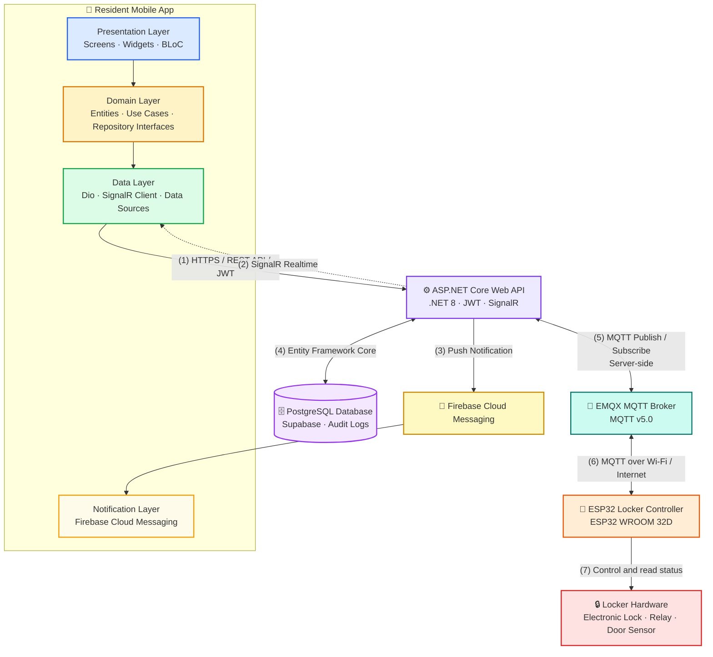

<p align="center">
  
</p>

<p align="center">
  
</p>

<p align="center">
  <strong>Language:</strong>
  <a href="./README.vn.md">🇻🇳 Tiếng Việt</a>
  &nbsp;|&nbsp;
  <a href="./README.md">🇬🇧 English</a>
</p>

<h3 align="center">
  📱 Resident Mobile App for SDLMS
</h3>

<p align="center">
  A smart parcel delivery management platform with real-time connectivity and IoT integration.
</p>

<p align="center">
  
  
  
  
  
  
</p>

<p align="center">
  <a href="#quick-start"></a>
  <a href="#tech-stack"></a>
  <a href="#architecture"></a>
  <a href="#related-repositories"></a>
  <a href="#development-team"></a>
</p>

## Overview

`smart-locking-mobile` is the Resident Mobile App of the Boxora system, allowing residents and office users to manage parcel deliveries, receive notifications, retrieve parcels, and remotely interact with assigned smart lockers.

### Main Screens

* **Authentication** — registers and signs in residents using a phone number and OTP.
* **Home Dashboard** — displays parcel summaries, notifications, and important locker status updates.
* **Parcel List** — shows active, completed, overdue, and historical parcels.
* **Parcel Details** — displays parcel information, storage status, assigned compartment, and retrieval methods.
* **Package Retrieval** — supports Personal QR Code, One-Time Password, and Remote App Unlock.
* **Notifications** — receives parcel and locker updates through Firebase Cloud Messaging.
* **Delivery Preferences** — allows residents to configure Auto or Manual delivery approval.
* **Profile & Settings** — manages resident information, security settings, and application preferences.

---

<a id="quick-start"></a>

<details open>
<summary><strong>🚀 Quick Start</strong></summary>

### Requirements

* Flutter SDK 3.22
* Dart SDK 3.4+
* Android Studio or Visual Studio Code
* Android emulator, iOS simulator, or physical device
* Xcode for iOS development on macOS

### Installation

```bash
git clone https://github.com/se-05-sdlms/smart-locking-mobile
cd smart-locking-mobile
flutter pub get
```

### Configuration

Configure the Backend API and SignalR Hub URLs according to the configuration method used by the source code.

```env
# TO BE FILLED IN using the exact variable names from the source code
API_BASE_URL=
SIGNALR_HUB_URL=
```

Add the Firebase configuration files for the required platforms:

```text
android/app/google-services.json
ios/Runner/GoogleService-Info.plist
```

### Run the Development Environment

```bash
flutter run
```

Or select a specific device:

```bash
flutter devices
flutter run -d <DEVICE_ID>
```

* App target: Android, iOS, emulator, simulator, or physical device
* Backend URL: update according to the local or deployed Backend environment

</details>

<a id="tech-stack"></a>

<details open>
<summary><strong>🧰 Tech Stack</strong></summary>

| Category                | Technology                           |
| ----------------------- | ------------------------------------ |
| Framework               | Flutter 3.22                         |
| Language                | Dart 3.4+                            |
| Architecture            | Clean Architecture                   |
| State management        | BLoC                                 |
| Networking              | Dio                                  |
| Realtime                | SignalR Client for Flutter           |
| Push notifications      | Firebase Cloud Messaging             |
| Local storage           | Project-specific implementation      |
| Testing                 | Flutter Test, BLoC Test, Mockito      |
| Supported platforms     | Android, iOS                         |

</details>

<a id="architecture"></a>

<details open>
<summary><strong>🏗️ Architecture</strong></summary>



The Mobile App communicates with the Backend through REST APIs, JWT, and SignalR. It receives push notifications through Firebase Cloud Messaging and does not connect directly to PostgreSQL, the MQTT Broker, or ESP32 devices.

</details>

<details open>
<summary><strong>🔐 Environment Variables</strong></summary>

Configure the application using the environment management approach implemented by the source code.

```env
# TO BE FILLED IN using the exact variable names from the source code
API_BASE_URL=
SIGNALR_HUB_URL=
```

Platform-specific Firebase configuration:

```text
android/app/google-services.json
ios/Runner/GoogleService-Info.plist
```

Do not commit production credentials, signing files, private keys, or sensitive environment configuration to Git.

</details>

<details>
<summary><strong>🧪 Build, Test, and Format</strong></summary>

```bash
# Install dependencies
flutter pub get

# Analyze the source code
flutter analyze

# Run all tests
flutter test

# Verify code formatting
dart format --output=none --set-exit-if-changed .

# Build Android APK
flutter build apk --release

# Build Android App Bundle
flutter build appbundle --release

# Build iOS on macOS
flutter build ios --release
```

</details>

<details>
<summary><strong>📁 Project Structure</strong></summary>

```text
smart-locking-mobile/
├── docs/
│   └── images/
│       └── readme-header.png
├── android/
├── ios/
├── assets/
├── lib/
│   ├── core/
│   ├── features/
│   ├── shared/
│   └── main.dart
├── test/
├── pubspec.yaml
├── README.vn.md
└── README.md
```

</details>

<a id="related-repositories"></a>

<details open>
<summary><strong>🔗 Related Repositories and Documentation</strong></summary>

| Component             | Link                                                                                                 |
| --------------------- | ---------------------------------------------------------------------------------------------------- |
| GitHub Organization   | [se-05-sdlms](https://github.com/se-05-sdlms)                                                        |
| Frontend              | [smart-locking-fe](https://github.com/se-05-sdlms/smart-locking-fe)                                  |
| Backend               | [smart-locking-be](https://github.com/se-05-sdlms/smart-locking-be)                                  |
| Project Documentation | [Google Drive](https://drive.google.com/drive/folders/1M3OPsm2NxAi7WnAfsKgV4MQEMRy5rOsa?usp=sharing) |

</details>

<a id="development-team"></a>

<details open>
<summary><strong>👥 Development Team</strong></summary>

* **Project code:** `SDLMS`
* **Group:** `SE_05`

### Supervisor

| Full name            | Role       | Email                                       |
| -------------------- | ---------- | ------------------------------------------- |
| MSc. Lê Thị Bích Tra | Supervisor | [traltb@fe.edu.vn](mailto:traltb@fe.edu.vn) |

### Members

| Student ID | Full name            | Role        | Email                                                             |
| ---------- | -------------------- | ----------- | ----------------------------------------------------------------- |
| DE180519   | Nguyễn Phan Huy      | Team Leader | [huynpde180519@fpt.edu.vn](mailto:huynpde180519@fpt.edu.vn)       |
| DE180405   | Phan Thành Vương     | Member      | [vuongptde180405@fpt.edu.vn](mailto:vuongptde180405@fpt.edu.vn)   |
| DE180313   | Võ Văn Hài           | Member      | [haivvde180313@fpt.edu.vn](mailto:haivvde180313@fpt.edu.vn)       |
| DE180393   | Trần Minh Cường      | Member      | [cuongtmde180393@fpt.edu.vn](mailto:cuongtmde180393@fpt.edu.vn)   |
| DE181072   | Trương Hà Thùy Trang | Member      | [trangthtde181072@fpt.edu.vn](mailto:trangthtde181072@fpt.edu.vn) |

</details>
