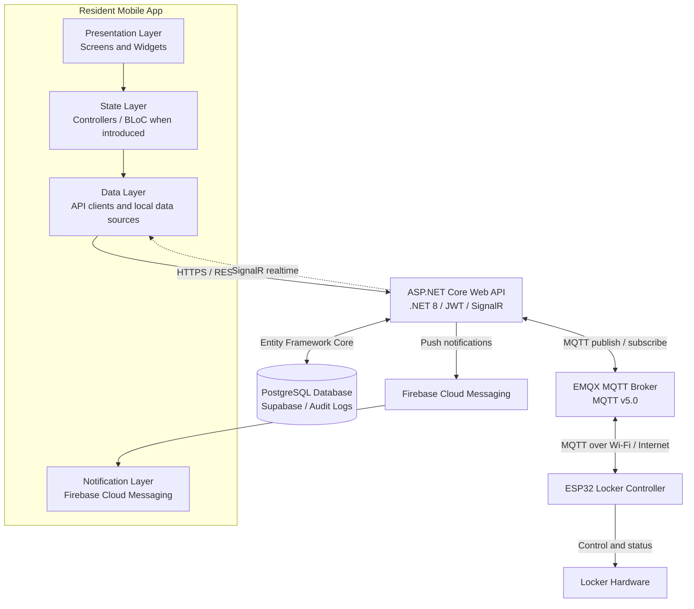

<p align="center">
  
</p>

<p align="center">
  
</p>

<p align="center">
  <strong>Language:</strong>
  <a href="./README.vn.md">Vietnamese</a>
  &nbsp;|&nbsp;
  <a href="./README.md">English</a>
</p>

<h3 align="center">
  Resident Mobile App for SDLMS
</h3>

<p align="center">
  A Flutter mobile app for Boxora smart locker residents, connected to the SDLMS backend.
</p>

<p align="center">
  
  
  
  
  
</p>

<p align="center">
  <a href="#quick-start"></a>
  <a href="#tech-stack"></a>
  <a href="#architecture"></a>
  <a href="#related-repositories"></a>
  <a href="#development-team"></a>
</p>

## Overview

`smart-locking-mobile` is the resident-facing Flutter app for the Boxora smart locker system. It is scaffolded as a standard Android and iOS Flutter project and is intended to support parcel notifications, parcel retrieval, resident delivery preferences, and remote locker interactions through the `smart-locking-be` backend.

### Planned Main Screens

* **Authentication** - resident sign-in and OTP-based account flows.
* **Home Dashboard** - parcel summaries, notifications, and locker status highlights.
* **Parcel List** - active, completed, overdue, and historical parcels.
* **Parcel Details** - parcel status, compartment information, and retrieval methods.
* **Package Retrieval** - QR code, one-time password, and remote unlock flows.
* **Notifications** - Firebase Cloud Messaging integration for parcel and locker updates.
* **Delivery Preferences** - automatic or manual parcel delivery approval.
* **Profile & Settings** - resident profile, security, and app preferences.

---

<a id="quick-start"></a>

<details open>
<summary><strong>Quick Start</strong></summary>

### Requirements

Install these tools before running the project:

* Flutter SDK 3.44.4 stable. The project was generated with Flutter 3.44.4.
* Dart SDK 3.12.2. The project SDK constraint is `^3.12.2`.
* Android Studio or Visual Studio Code with Flutter/Dart plugins.
* JDK 17 for Android builds.
* Android emulator, iOS simulator, or physical device.
* Xcode for iOS development on macOS.

```bash
flutter --version
dart --version
java -version
flutter doctor
```

Current package and tool versions used by this repository:

| Area | Package or tool | Version |
| ---- | --------------- | ------- |
| Flutter SDK | `flutter` | `3.44.4` |
| Dart SDK | `dart` | `3.12.2` |
| Pub SDK constraint | `environment.sdk` | `^3.12.2` |
| App package | `smart_locking_mobile` | `1.0.0+1` |
| Runtime dependency | `cupertino_icons` | `1.0.9` resolved from `^1.0.8` |
| Dev dependency | `flutter_lints` | `6.0.0` |
| Android toolchain | Android Gradle Plugin | `9.0.1` |
| Android toolchain | Kotlin Gradle Plugin | `2.3.20` |
| Android toolchain | Gradle Wrapper | `9.1.0` |
| Android toolchain | Java | `17` |

These versions are compatible with the current generated Flutter project. Do not upgrade Flutter, Dart, Android Gradle Plugin, Kotlin, or Gradle to a new major version unless the project is intentionally migrated and verified.

### Installation

```bash
git clone https://github.com/se-05-sdlms/smart-locking-mobile
cd smart-locking-mobile
flutter pub get
```

### Configuration

The initial scaffold does not commit local secrets. Configure backend, SignalR, and Firebase values using the configuration layer implemented by the app source code.

```env
API_BASE_URL=
SIGNALR_HUB_URL=
```

Add Firebase configuration files only on local machines or through secure CI secrets:

```text
android/app/google-services.json
ios/Runner/GoogleService-Info.plist
```

### Run the Development Environment

```bash
flutter run
```

Or select a specific device:

```bash
flutter devices
flutter run -d <DEVICE_ID>
```

* Android application ID: `vn.edu.fpt.sdlms.smart_locking_mobile`
* Android namespace: `vn.edu.fpt.sdlms.smart_locking_mobile`
* Supported generated platforms: Android and iOS

</details>

<a id="tech-stack"></a>

<details open>
<summary><strong>Tech Stack</strong></summary>

| Category | Technology |
| -------- | ---------- |
| Framework | Flutter 3.44.4 |
| Language | Dart 3.12.2 |
| Generated platforms | Android, iOS |
| Android build | Java 17, Android Gradle Plugin 9.0.1, Kotlin 2.3.20, Gradle 9.1.0 |
| Initial app dependency | cupertino_icons |
| Linting | flutter_lints 6.0.0 |
| Testing | Flutter Test |
| CI | GitHub Actions |
| Backend integration | ASP.NET Core Web API, .NET 8 |
| Planned realtime | SignalR |
| Planned notifications | Firebase Cloud Messaging |

</details>

<a id="architecture"></a>

<details open>
<summary><strong>Architecture</strong></summary>



The mobile app communicates with the backend through REST APIs, JWT, and planned SignalR realtime channels. It does not connect directly to PostgreSQL, MQTT, or ESP32 devices.

</details>

<details open>
<summary><strong>Environment Variables</strong></summary>

Configure runtime values through the app configuration approach implemented in source code.

```env
API_BASE_URL=
SIGNALR_HUB_URL=
```

Do not commit production credentials, signing files, private keys, Firebase configuration, or sensitive environment files.

</details>

<details>
<summary><strong>Build, Test, and Format</strong></summary>

```bash
# Install dependencies
flutter pub get

# Verify code formatting
dart format --output=none --set-exit-if-changed .

# Analyze source code
flutter analyze

# Run all tests
flutter test

# Build Android debug APK, same build target used by CI
flutter build apk --debug

# Build Android release APK
flutter build apk --release

# Build Android App Bundle
flutter build appbundle --release

# Build iOS on macOS
flutter build ios --release
```

GitHub Actions runs restore, format, analyze, test, and Android debug APK build on pushes and pull requests targeting `main` or `dev`.

</details>

<details>
<summary><strong>Project Structure</strong></summary>

```text
smart-locking-mobile/
|-- .github/
|   `-- workflows/
|       `-- ci.yml
|-- android/
|-- docs/
|   `-- images/
|-- ios/
|-- lib/
|   `-- main.dart
|-- test/
|   `-- widget_test.dart
|-- analysis_options.yaml
|-- pubspec.yaml
|-- README.vn.md
`-- README.md
```

</details>

<a id="related-repositories"></a>

<details open>
<summary><strong>Related Repositories and Documentation</strong></summary>

| Component | Link |
| --------- | ---- |
| GitHub Organization | [se-05-sdlms](https://github.com/se-05-sdlms) |
| Frontend | [smart-locking-fe](https://github.com/se-05-sdlms/smart-locking-fe) |
| Backend | [smart-locking-be](https://github.com/se-05-sdlms/smart-locking-be) |
| Project Documentation | [Google Drive](https://drive.google.com/drive/folders/1M3OPsm2NxAi7WnAfsKgV4MQEMRy5rOsa?usp=sharing) |

</details>

<a id="development-team"></a>

<details open>
<summary><strong>Development Team</strong></summary>

* **Project code:** `SDLMS`
* **Group:** `SE_05`

### Supervisor

| Full name | Role | Email |
| --------- | ---- | ----- |
| MSc. Le Thi Bich Tra | Supervisor | [traltb@fe.edu.vn](mailto:traltb@fe.edu.vn) |

### Members

| Student ID | Full name | Role | Email |
| ---------- | --------- | ---- | ----- |
| DE180519 | Nguyen Phan Huy | Team Leader | [huynpde180519@fpt.edu.vn](mailto:huynpde180519@fpt.edu.vn) |
| DE180405 | Phan Thanh Vuong | Member | [vuongptde180405@fpt.edu.vn](mailto:vuongptde180405@fpt.edu.vn) |
| DE180313 | Vo Van Hai | Member | [haivvde180313@fpt.edu.vn](mailto:haivvde180313@fpt.edu.vn) |
| DE180393 | Tran Minh Cuong | Member | [cuongtmde180393@fpt.edu.vn](mailto:cuongtmde180393@fpt.edu.vn) |
| DE181072 | Truong Ha Thuy Trang | Member | [trangthtde181072@fpt.edu.vn](mailto:trangthtde181072@fpt.edu.vn) |

</details>
