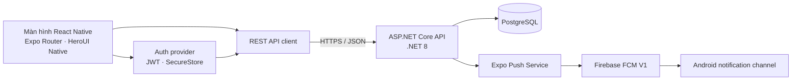

<p align="center">
  
</p>

<p align="center">
  
</p>

<p align="center">
  <strong>Ngôn ngữ:</strong>
  <a href="./README.vn.md">🇻🇳 Tiếng Việt</a>
  &nbsp;|&nbsp;
  <a href="./README.md">🇬🇧 English</a>
</p>

<h3 align="center">📱 Ứng dụng cư dân Boxora</h3>

<p align="center">
  Ứng dụng React Native giúp cư dân quản lý bưu kiện và tương tác với hệ thống tủ thông minh Boxora.
</p>

<p align="center">
  
  
  
  
  
</p>

## Tổng quan

`smart-locking-mobile` là ứng dụng dành cho cư dân trong hệ thống Boxora. Ứng dụng sử dụng Expo Router để điều hướng, REST API .NET cho các thao tác xác thực, SecureStore để lưu phiên đăng nhập và Expo Push Notifications kết hợp Firebase Cloud Messaging V1 trên Android.

Các khu vực đã được triển khai gồm:

- Đăng nhập cư dân, refresh token, đăng xuất và tải hồ sơ.
- Xin quyền thông báo Android, đăng ký Expo push token và hiển thị thông báo.
- Màn hình đơn hàng, lịch sử, thông báo, tài khoản, duyệt yêu cầu giao hàng, thanh toán quá hạn và mở ngăn tủ.
- Giao diện responsive bằng HeroUI Native và Uniwind/Tailwind CSS.

Đăng nhập, hồ sơ cư dân và đăng ký thiết bị đã kết nối với backend. Các màn hình bưu kiện và quy trình giao hàng hiện vẫn dùng dữ liệu prototype/mock và cần nối endpoint backend trước khi dùng production.

## Bắt đầu nhanh

### Yêu cầu

- Node.js 20 trở lên và npm.
- JDK 17.
- Android Studio cùng Android SDK Platform Tools.
- Điện thoại Android đã bật USB debugging hoặc Android emulator.
- Với script Android trên Windows: CMake `3.30.5` và Ninja `1.12.0` trở lên.
- Xcode trên macOS nếu phát triển iOS.

### Cài đặt

```powershell
git clone https://github.com/se-05-sdlms/smart-locking-mobile
cd smart-locking-mobile
npm install
Copy-Item .env.example .env
```

### Cấu hình API

Cấu hình development mặc định sử dụng backend tại cổng `5005`:

```env
EXPO_PUBLIC_API_URL=http://localhost:5005/api
EXPO_PUBLIC_API_TIMEOUT=15000
```

Khi điện thoại Android kết nối qua USB, `npm run android` chuyển tiếp cổng `5005` và `8081` bằng ADB. Vì vậy điện thoại có thể truy cập backend local và Metro qua `localhost`.

### Cấu hình push notification Android

1. Đăng ký `com.wykowjbu.boxora` làm Android app trong Firebase.
2. Đặt file public `google-services.json` tại thư mục gốc của repository.
3. Upload Firebase service-account JSON vào FCM V1 credentials của Expo project.
4. Không commit Firebase service-account JSON hoặc khóa ký Android.

Ứng dụng sử dụng Expo project ID `535b5783-6307-4982-a796-1aa71e988fef` và notification channel `default`.

### Chạy trên Android

Khởi động backend .NET trước, kết nối và cấp quyền cho điện thoại, sau đó chạy:

```powershell
npm run android
```

Script sẽ kiểm tra Android toolchain, chọn thiết bị đang kết nối, cấu hình ADB reverse và build/chạy native development app.

Các lệnh development khác:

```powershell
npm start          # Chạy Expo development server
npm run ios        # Build và chạy iOS trên macOS
npm run lint       # Chạy ESLint
npm run typecheck  # Kiểm tra TypeScript
npm run format     # Format các file được hỗ trợ
npm run format:check
```

## Công nghệ

| Nhóm              | Công nghệ                                              |
| ----------------- | ------------------------------------------------------ |
| Mobile framework  | React Native 0.86, Expo SDK 57                         |
| Ngôn ngữ          | TypeScript 6, React 19                                 |
| Điều hướng        | Expo Router                                            |
| UI và styling     | HeroUI Native, Uniwind, Tailwind CSS 4                 |
| API               | REST client dùng Fetch, JWT access/refresh token       |
| Lưu trữ bảo mật   | Expo SecureStore                                       |
| Push notification | Expo Notifications, Expo Push Service, Firebase FCM V1 |
| Backend           | ASP.NET Core Web API trên .NET 8                       |
| Nền tảng          | Android và iOS                                         |

## Kiến trúc



Ứng dụng mobile không kết nối trực tiếp đến PostgreSQL hoặc phần cứng tủ. Mọi thao tác được bảo vệ đều đi qua backend API.

## Cấu trúc dự án

```text
smart-locking-mobile/
├── assets/                  # Icon và splash screen của app
├── docs/images/             # Hình ảnh dùng trong README
├── scripts/
│   └── run-android.ps1      # Script build/chạy Android trên Windows
├── src/
│   ├── app/                 # Màn hình và tab route của Expo Router
│   ├── components/          # UI và icon dùng chung
│   ├── config/              # Cấu hình biến môi trường
│   ├── data/                # Dữ liệu bưu kiện prototype
│   ├── lib/                 # REST API client
│   ├── providers/           # Xác thực và đăng ký push token
│   └── global.css           # Uniwind/Tailwind và HeroUI styles
├── app.json                 # Cấu hình Expo và native plugin
├── eas.json                 # EAS build profile
├── google-services.json     # Cấu hình Firebase Android phía client
├── package.json
├── README.vn.md
└── README.md
```

## Lưu ý bảo mật

- `.env` chỉ dùng ở máy local; chỉ commit `.env.example`.
- `google-services.json` định danh Firebase client, không chứa FCM service-account private key.
- Không commit file `*-firebase-adminsdk-*.json`, keystore, signing key hoặc production secret.

## Repo liên quan

| Thành phần          | Liên kết                                                                                             |
| ------------------- | ---------------------------------------------------------------------------------------------------- |
| GitHub organization | [se-05-sdlms](https://github.com/se-05-sdlms)                                                        |
| Web frontend        | [smart-locking-fe](https://github.com/se-05-sdlms/smart-locking-fe)                                  |
| Backend             | [smart-locking-be](https://github.com/se-05-sdlms/smart-locking-be)                                  |
| Tài liệu dự án      | [Google Drive](https://drive.google.com/drive/folders/1M3OPsm2NxAi7WnAfsKgV4MQEMRy5rOsa?usp=sharing) |

## Nhóm phát triển

- **Mã dự án:** `SDLMS`
- **Nhóm:** `SE_05`

### Giảng viên hướng dẫn

| Họ và tên            | Vai trò              | Email                                       |
| -------------------- | -------------------- | ------------------------------------------- |
| ThS. Lê Thị Bích Tra | Giảng viên hướng dẫn | [traltb@fe.edu.vn](mailto:traltb@fe.edu.vn) |

### Thành viên

| MSSV     | Họ và tên            | Vai trò     | Email                                                             |
| -------- | -------------------- | ----------- | ----------------------------------------------------------------- |
| DE180519 | Nguyễn Phan Huy      | Trưởng nhóm | [huynpde180519@fpt.edu.vn](mailto:huynpde180519@fpt.edu.vn)       |
| DE180405 | Phan Thành Vương     | Thành viên  | [vuongptde180405@fpt.edu.vn](mailto:vuongptde180405@fpt.edu.vn)   |
| DE180313 | Võ Văn Hài           | Thành viên  | [haivvde180313@fpt.edu.vn](mailto:haivvde180313@fpt.edu.vn)       |
| DE180393 | Trần Minh Cường      | Thành viên  | [cuongtmde180393@fpt.edu.vn](mailto:cuongtmde180393@fpt.edu.vn)   |
| DE181072 | Trương Hà Thùy Trang | Thành viên  | [trangthtde181072@fpt.edu.vn](mailto:trangthtde181072@fpt.edu.vn) |
