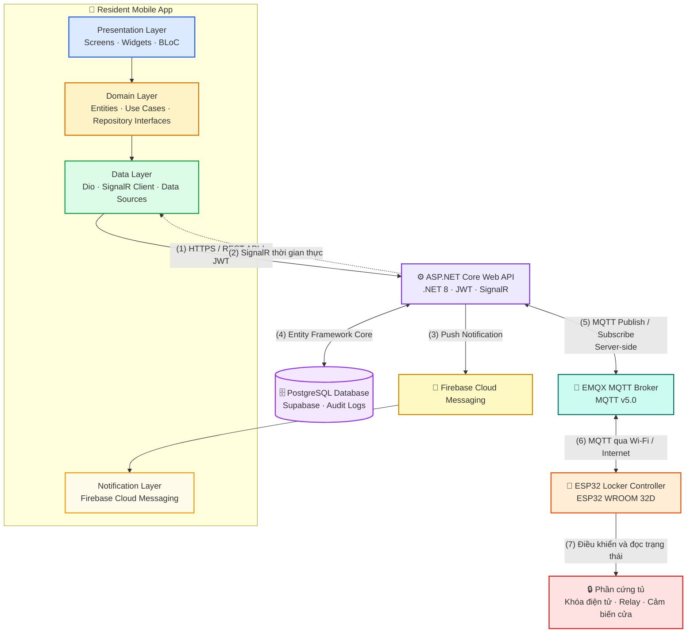

<p align="center">
  
</p>

<p align="center">
  
</p>

<p align="center">
  <strong>Ngôn ngữ:</strong>
  <a href="./README.vn.md">🇻🇳 Tiếng Việt</a>
  &nbsp;|&nbsp;
  <a href="./README.md">🇬🇧 English</a>
</p>

<h3 align="center">
  📱 Resident Mobile App của SDLMS
</h3>

<p align="center">
  Nền tảng quản lý giao nhận bưu kiện thông minh, kết nối thời gian thực và tích hợp IoT.
</p>

<p align="center">
  
  
  
  
  
  
</p>

<p align="center">
  <a href="#quick-start"></a>
  <a href="#tech-stack"></a>
  <a href="#architecture"></a>
  <a href="#related-repositories"></a>
  <a href="#development-team"></a>
</p>

## Tổng quan

`smart-locking-mobile` là Resident Mobile App của hệ thống Boxora, cho phép cư dân và người dùng văn phòng quản lý việc giao nhận bưu kiện, nhận thông báo, lấy hàng và tương tác từ xa với tủ thông minh được chỉ định.

### Các màn hình chính

* **Authentication** — đăng ký và đăng nhập cư dân bằng số điện thoại và OTP.
* **Home Dashboard** — hiển thị tổng quan bưu kiện, thông báo và các cập nhật quan trọng của tủ.
* **Danh sách bưu kiện** — hiển thị bưu kiện đang hoạt động, đã hoàn thành, quá hạn và lịch sử.
* **Chi tiết bưu kiện** — hiển thị thông tin bưu kiện, trạng thái lưu trữ, ngăn tủ và phương thức nhận hàng.
* **Nhận bưu kiện** — hỗ trợ Personal QR Code, One-Time Password và Remote App Unlock.
* **Thông báo** — nhận cập nhật bưu kiện và trạng thái tủ qua Firebase Cloud Messaging.
* **Tùy chọn giao hàng** — cho phép cư dân cấu hình chế độ phê duyệt giao hàng Auto hoặc Manual.
* **Hồ sơ & Cài đặt** — quản lý thông tin cư dân, thiết lập bảo mật và tùy chọn ứng dụng.

---

<a id="quick-start"></a>

<details open>
<summary><strong>🚀 Bắt đầu nhanh</strong></summary>

### Yêu cầu

* Flutter SDK 3.22
* Dart SDK 3.4+
* Android Studio hoặc Visual Studio Code
* Android emulator, iOS simulator hoặc thiết bị thật
* Xcode để phát triển iOS trên macOS

### Cài đặt

```bash
git clone https://github.com/se-05-sdlms/smart-locking-mobile
cd smart-locking-mobile
flutter pub get
```

### Cấu hình

Cấu hình URL của Backend API và SignalR Hub theo phương thức cấu hình được sử dụng trong source code.

```env
# NGƯỜI DÙNG CẦN ĐIỀN đúng tên biến từ source code
API_BASE_URL=
SIGNALR_HUB_URL=
```

Thêm file cấu hình Firebase cho các nền tảng cần sử dụng:

```text
android/app/google-services.json
ios/Runner/GoogleService-Info.plist
```

### Chạy môi trường phát triển

```bash
flutter run
```

Hoặc chọn thiết bị cụ thể:

```bash
flutter devices
flutter run -d <DEVICE_ID>
```

* App target: Android, iOS, emulator, simulator hoặc thiết bị thật
* Backend URL: cập nhật theo môi trường Backend local hoặc đã deploy

</details>

<a id="tech-stack"></a>

<details open>
<summary><strong>🧰 Công nghệ</strong></summary>

| Nhóm                    | Công nghệ                            |
| ----------------------- | ------------------------------------ |
| Framework               | Flutter 3.22                         |
| Language                | Dart 3.4+                            |
| Architecture            | Clean Architecture                   |
| State management        | BLoC                                 |
| Networking              | Dio                                  |
| Realtime                | SignalR Client cho Flutter           |
| Push notification       | Firebase Cloud Messaging             |
| Local storage           | Theo implementation của project      |
| Testing                 | Flutter Test, BLoC Test, Mockito      |
| Nền tảng hỗ trợ         | Android, iOS                         |

</details>

<a id="architecture"></a>

<details open>
<summary><strong>🏗️ Kiến trúc</strong></summary>



Mobile App giao tiếp với Backend thông qua REST API, JWT và SignalR. Ứng dụng nhận push notification qua Firebase Cloud Messaging, không kết nối trực tiếp đến PostgreSQL, MQTT Broker hoặc thiết bị ESP32.

</details>

<details open>
<summary><strong>🔐 Biến môi trường</strong></summary>

Cấu hình ứng dụng theo phương thức quản lý môi trường được triển khai trong source code.

```env
# NGƯỜI DÙNG CẦN ĐIỀN đúng tên biến từ source code
API_BASE_URL=
SIGNALR_HUB_URL=
```

Cấu hình Firebase theo từng nền tảng:

```text
android/app/google-services.json
ios/Runner/GoogleService-Info.plist
```

Không commit production credential, signing file, private key hoặc cấu hình môi trường nhạy cảm lên Git.

</details>

<details>
<summary><strong>🧪 Build, test và format</strong></summary>

```bash
# Cài đặt dependency
flutter pub get

# Phân tích source code
flutter analyze

# Chạy toàn bộ test
flutter test

# Kiểm tra format
dart format --output=none --set-exit-if-changed .

# Build Android APK
flutter build apk --release

# Build Android App Bundle
flutter build appbundle --release

# Build iOS trên macOS
flutter build ios --release
```

</details>

<details>
<summary><strong>📁 Cấu trúc dự án</strong></summary>

```text
smart-locking-mobile/
├── docs/
│   └── images/
│       └── readme-header.png
├── android/
├── ios/
├── assets/
├── lib/
│   ├── core/
│   ├── features/
│   ├── shared/
│   └── main.dart
├── test/
├── pubspec.yaml
├── README.vn.md
└── README.md
```

</details>

<a id="related-repositories"></a>

<details open>
<summary><strong>🔗 Repo và tài liệu liên quan</strong></summary>

| Thành phần           | Liên kết                                                                                             |
| -------------------- | ---------------------------------------------------------------------------------------------------- |
| GitHub Organization  | [se-05-sdlms](https://github.com/se-05-sdlms)                                                        |
| Frontend             | [smart-locking-fe](https://github.com/se-05-sdlms/smart-locking-fe)                                  |
| Backend              | [smart-locking-be](https://github.com/se-05-sdlms/smart-locking-be)                                  |
| Tài liệu dự án       | [Google Drive](https://drive.google.com/drive/folders/1M3OPsm2NxAi7WnAfsKgV4MQEMRy5rOsa?usp=sharing) |

</details>

<a id="development-team"></a>

<details open>
<summary><strong>👥 Nhóm phát triển</strong></summary>

* **Mã dự án:** `SDLMS`
* **Nhóm:** `SE_05`

### Giảng viên hướng dẫn

| Họ và tên            | Vai trò              | Email                                       |
| -------------------- | -------------------- | ------------------------------------------- |
| ThS. Lê Thị Bích Tra | Giảng viên hướng dẫn | [traltb@fe.edu.vn](mailto:traltb@fe.edu.vn) |

### Thành viên

| MSSV     | Họ và tên            | Vai trò     | Email                                                             |
| -------- | -------------------- | ----------- | ----------------------------------------------------------------- |
| DE180519 | Nguyễn Phan Huy      | Trưởng nhóm | [huynpde180519@fpt.edu.vn](mailto:huynpde180519@fpt.edu.vn)       |
| DE180405 | Phan Thành Vương     | Thành viên  | [vuongptde180405@fpt.edu.vn](mailto:vuongptde180405@fpt.edu.vn)   |
| DE180313 | Võ Văn Hài           | Thành viên  | [haivvde180313@fpt.edu.vn](mailto:haivvde180313@fpt.edu.vn)       |
| DE180393 | Trần Minh Cường      | Thành viên  | [cuongtmde180393@fpt.edu.vn](mailto:cuongtmde180393@fpt.edu.vn)   |
| DE181072 | Trương Hà Thùy Trang | Thành viên  | [trangthtde181072@fpt.edu.vn](mailto:trangthtde181072@fpt.edu.vn) |

</details>
