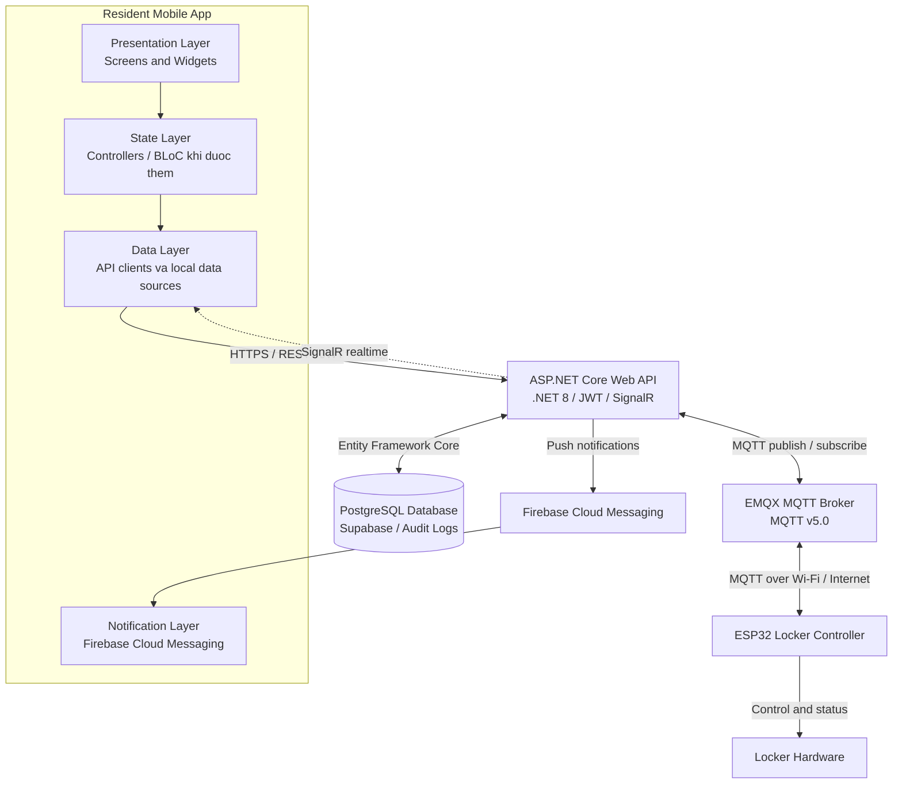

<p align="center">
  
</p>

<p align="center">
  
</p>

<p align="center">
  <strong>Ngon ngu:</strong>
  <a href="./README.vn.md">Tieng Viet</a>
  &nbsp;|&nbsp;
  <a href="./README.md">English</a>
</p>

<h3 align="center">
  Resident Mobile App cua SDLMS
</h3>

<p align="center">
  Ung dung Flutter cho cu dan su dung tu khoa thong minh Boxora, ket noi voi backend SDLMS.
</p>

<p align="center">
  
  
  
  
  
</p>

<p align="center">
  <a href="#quick-start"></a>
  <a href="#tech-stack"></a>
  <a href="#architecture"></a>
  <a href="#related-repositories"></a>
  <a href="#development-team"></a>
</p>

## Tong quan

`smart-locking-mobile` la ung dung Flutter danh cho cu dan trong he thong tu khoa thong minh Boxora. Project da duoc scaffold theo chuan Flutter cho Android va iOS, va se ho tro thong bao buu kien, nhan buu kien, tuy chon giao hang cua cu dan, cung cac thao tac tu xa voi tu thong qua backend `smart-locking-be`.

### Cac man hinh du kien

- **Authentication** - dang nhap cu dan va cac luong tai khoan bang OTP.
- **Home Dashboard** - tong quan buu kien, thong bao va trang thai tu quan trong.
- **Danh sach buu kien** - buu kien dang xu ly, da hoan thanh, qua han va lich su.
- **Chi tiet buu kien** - trang thai buu kien, thong tin ngan tu va phuong thuc nhan hang.
- **Nhan buu kien** - QR code, OTP mot lan va mo tu tu xa.
- **Thong bao** - tich hop Firebase Cloud Messaging cho cap nhat buu kien va tu.
- **Tuy chon giao hang** - phe duyet giao hang tu dong hoac thu cong.
- **Ho so & Cai dat** - ho so cu dan, bao mat va tuy chon ung dung.

---

<a id="quick-start"></a>

<details open>
<summary><strong>Bat dau nhanh</strong></summary>

### Yeu cau

Cai cac cong cu sau truoc khi chay project:

- Flutter SDK 3.44.4 stable. Project duoc tao bang Flutter 3.44.4.
- Dart SDK 3.12.2. Rang buoc SDK cua project la `^3.12.2`.
- Android Studio hoac Visual Studio Code kem plugin Flutter/Dart.
- JDK 17 de build Android.
- Android emulator, iOS simulator hoac thiet bi that.
- Xcode de phat trien iOS tren macOS.

```bash
flutter --version
dart --version
java -version
flutter doctor
```

Cac version package va tool hien dang dung trong repository:

| Nhom               | Package hoac tool      | Version                      |
| ------------------ | ---------------------- | ---------------------------- |
| Flutter SDK        | `flutter`              | `3.44.4`                     |
| Dart SDK           | `dart`                 | `3.12.2`                     |
| Pub SDK constraint | `environment.sdk`      | `^3.12.2`                    |
| App package        | `smart_locking_mobile` | `1.0.0+1`                    |
| Runtime dependency | `cupertino_icons`      | `1.0.9` resolved tu `^1.0.8` |
| Dev dependency     | `flutter_lints`        | `6.0.0`                      |
| Android toolchain  | Android Gradle Plugin  | `9.0.1`                      |
| Android toolchain  | Kotlin Gradle Plugin   | `2.3.20`                     |
| Android toolchain  | Gradle Wrapper         | `9.1.0`                      |
| Android toolchain  | Java                   | `17`                         |

Cac version nay tuong thich voi Flutter project hien tai. Khong nang Flutter, Dart, Android Gradle Plugin, Kotlin hoac Gradle len major version moi tru khi project duoc migrate va verify co chu dich.

### Cai dat

```bash
git clone https://github.com/se-05-sdlms/smart-locking-mobile
cd smart-locking-mobile
flutter pub get
```

### Cau hinh

Scaffold ban dau khong commit secret local. Cau hinh backend, SignalR va Firebase thong qua lop cau hinh se duoc trien khai trong source code cua app.

```env
API_BASE_URL=
SIGNALR_HUB_URL=
```

Chi them file cau hinh Firebase tren may local hoac thong qua CI secrets an toan:

```text
android/app/google-services.json
ios/Runner/GoogleService-Info.plist
```

### Chay moi truong phat trien

```bash
flutter run
```

Hoac chon thiet bi cu the:

```bash
flutter devices
flutter run -d <DEVICE_ID>
```

- Android application ID: `vn.edu.fpt.sdlms.smart_locking_mobile`
- Android namespace: `vn.edu.fpt.sdlms.smart_locking_mobile`
- Nen tang scaffold hien co: Android va iOS

</details>

<a id="tech-stack"></a>

<details open>
<summary><strong>Cong nghe</strong></summary>

| Nhom                      | Cong nghe                                                         |
| ------------------------- | ----------------------------------------------------------------- |
| Framework                 | Flutter 3.44.4                                                    |
| Language                  | Dart 3.12.2                                                       |
| Nen tang scaffold         | Android, iOS                                                      |
| Android build             | Java 17, Android Gradle Plugin 9.0.1, Kotlin 2.3.20, Gradle 9.1.0 |
| Dependency ban dau        | cupertino_icons                                                   |
| Linting                   | flutter_lints 6.0.0                                               |
| Testing                   | Flutter Test                                                      |
| CI                        | GitHub Actions                                                    |
| Backend integration       | ASP.NET Core Web API, .NET 8                                      |
| Realtime du kien          | SignalR                                                           |
| Push notification du kien | Firebase Cloud Messaging                                          |

</details>

<a id="architecture"></a>

<details open>
<summary><strong>Kien truc</strong></summary>



Mobile app giao tiep voi backend thong qua REST API, JWT va kenh SignalR du kien. Ung dung khong ket noi truc tiep den PostgreSQL, MQTT hoac ESP32.

</details>

<details open>
<summary><strong>Bien moi truong</strong></summary>

Cau hinh cac gia tri runtime thong qua cach quan ly cau hinh duoc trien khai trong source code.

```env
API_BASE_URL=
SIGNALR_HUB_URL=
```

Khong commit production credential, signing file, private key, cau hinh Firebase hoac file moi truong nhay cam.

</details>

<details>
<summary><strong>Build, test va format</strong></summary>

```bash
# Cai dependency
flutter pub get

# Kiem tra format
dart format --output=none --set-exit-if-changed .

# Phan tich source code
flutter analyze

# Chay toan bo test
flutter test

# Build Android debug APK, cung target voi CI
flutter build apk --debug

# Build Android release APK
flutter build apk --release

# Build Android App Bundle
flutter build appbundle --release

# Build iOS tren macOS
flutter build ios --release
```

GitHub Actions chay restore, format, analyze, test va build Android debug APK khi push hoac tao pull request vao `main` hoac `dev`.

</details>

<details>
<summary><strong>Cau truc du an</strong></summary>

```text
smart-locking-mobile/
|-- .github/
|   `-- workflows/
|       `-- ci.yml
|-- android/
|-- docs/
|   `-- images/
|-- ios/
|-- lib/
|   `-- main.dart
|-- test/
|   `-- widget_test.dart
|-- analysis_options.yaml
|-- pubspec.yaml
|-- README.vn.md
`-- README.md
```

</details>

<a id="related-repositories"></a>

<details open>
<summary><strong>Repo va tai lieu lien quan</strong></summary>

| Thanh phan          | Link                                                                                                 |
| ------------------- | ---------------------------------------------------------------------------------------------------- |
| GitHub Organization | [se-05-sdlms](https://github.com/se-05-sdlms)                                                        |
| Frontend            | [smart-locking-fe](https://github.com/se-05-sdlms/smart-locking-fe)                                  |
| Backend             | [smart-locking-be](https://github.com/se-05-sdlms/smart-locking-be)                                  |
| Tai lieu du an      | [Google Drive](https://drive.google.com/drive/folders/1M3OPsm2NxAi7WnAfsKgV4MQEMRy5rOsa?usp=sharing) |

</details>

<a id="development-team"></a>

<details open>
<summary><strong>Nhom phat trien</strong></summary>

- **Ma du an:** `SDLMS`
- **Nhom:** `SE_05`

### Giang vien huong dan

| Ho va ten            | Vai tro              | Email                                       |
| -------------------- | -------------------- | ------------------------------------------- |
| ThS. Le Thi Bich Tra | Giang vien huong dan | [traltb@fe.edu.vn](mailto:traltb@fe.edu.vn) |

### Thanh vien

| MSSV     | Ho va ten            | Vai tro     | Email                                                             |
| -------- | -------------------- | ----------- | ----------------------------------------------------------------- |
| DE180519 | Nguyen Phan Huy      | Truong nhom | [huynpde180519@fpt.edu.vn](mailto:huynpde180519@fpt.edu.vn)       |
| DE180405 | Phan Thanh Vuong     | Thanh vien  | [vuongptde180405@fpt.edu.vn](mailto:vuongptde180405@fpt.edu.vn)   |
| DE180313 | Vo Van Hai           | Thanh vien  | [haivvde180313@fpt.edu.vn](mailto:haivvde180313@fpt.edu.vn)       |
| DE180393 | Tran Minh Cuong      | Thanh vien  | [cuongtmde180393@fpt.edu.vn](mailto:cuongtmde180393@fpt.edu.vn)   |
| DE181072 | Truong Ha Thuy Trang | Thanh vien  | [trangthtde181072@fpt.edu.vn](mailto:trangthtde181072@fpt.edu.vn) |

</details>
